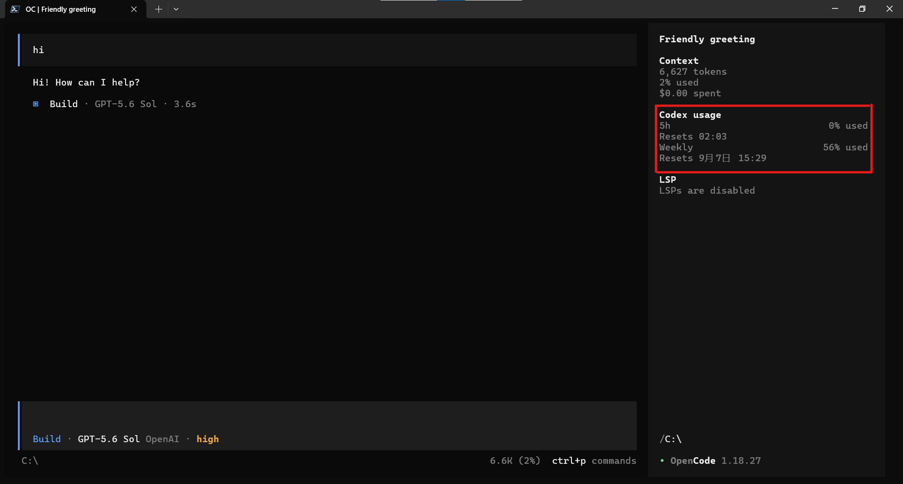

# OpenCode Codex Usage

[English](#english) | [简体中文](#简体中文)



## English

Displays ChatGPT Codex subscription usage in the **OpenCode V2** terminal sidebar.
Version 0.3.0 requires **OpenCode 2.0.18 or later** and uses the V2 plugin API.

### Features

- Shows the percentage used for the 5-hour and weekly Codex limits, with local reset times.
- Hides when no OpenAI OAuth account is selected; refreshes on credential updates and account switches.
- Queries at startup, about 2 and 15 seconds after a session becomes idle, and every minute.
- Makes no model requests and consumes no additional Codex model quota.
- Queries usage on the connected OpenCode server; the terminal receives only usage data via RPC.

### Install from source

Use Node.js **26.4 or later** for development (required by the OpenTUI development dependency), npm, and GitHub CLI:

```sh
gh repo clone wuyh410/opencode-subscription-usage
cd opencode-subscription-usage
npm ci
npm run typecheck
npm test
node bin/opencode-codex-usage.mjs install
```

The installer copies the built package to:

```text
~/.config/opencode/local-plugins/codex-usage/
```

It adds `./local-plugins/codex-usage` to `plugins` in global `opencode.json(c)`, preserving comments,
other plugins, and unrelated settings. `OPENCODE_CONFIG_DIR` or `$XDG_CONFIG_HOME/opencode` overrides
the default configuration directory. Run the installer again after rebuilding to update the installed copy.

The server entrypoint and `./tui` entrypoint load together. No separate `cli.json` entry is needed.
Restart the terminal client after installation. If the server has not reloaded the plugin, run `opencode reload`.
For a remote server, install on that server; the terminal gets the plugin from its active plugin list.

Connect OpenAI using the ChatGPT Plus/Pro OAuth method and open a session with a terminal wide enough
for the sidebar. This extension is for the full-screen terminal UI.

**This project is not published to npm.** The npm package named `opencode-codex-usage` belongs to another
author. Do not use `npx opencode-codex-usage` or install that package from the registry.

### Install a locally built archive

```sh
npm pack
npm install --global ./opencode-codex-usage-0.3.0.tgz
opencode-codex-usage install
```

The archive contains `dist/`. To install it without Node.js, extract it and run its PowerShell 7 installer:

```powershell
tar -xzf ./opencode-codex-usage-0.3.0.tgz
pwsh -NoProfile -File ./package/install.ps1
```

GitHub's automatic source archives do not contain built files. Previous upstream 0.2.x releases use the V1 API
and cannot be installed in V2.

### Uninstall

From the source checkout:

```sh
node bin/opencode-codex-usage.mjs uninstall
```

For a global npm installation, use `opencode-codex-usage uninstall`, then
`npm uninstall --global opencode-codex-usage`. For a manual installation, remove the managed directory
and its entry from `plugins` in `opencode.json(c)`. Restart the terminal client.

### How it works

The server plugin resolves the active OpenAI connection through the V2 integration API on every refresh,
then requests `https://chatgpt.com/backend-api/wham/usage`. It does not read legacy `auth.json` files.
Access tokens and account IDs are sent only to ChatGPT for this request, and never returned through RPC.
Usage data is kept in memory. The endpoint is internal and may change without notice.

If the sidebar is absent, check that the plugin is active, OpenAI is connected via OAuth, and the terminal
is wide enough. If login has expired, reconnect OpenAI. Upstream usage reporting may lag a completed request.

### Development

```sh
npm ci
npm run typecheck
npm test
npm pack
```

Tests cover active-account credential resolution, usage requests, and installation/uninstallation in isolated
temporary directories. `index.js` and `tui.js` expose the built entrypoints at the package root for V2 local-directory discovery.

## 简体中文

在 **OpenCode V2** 终端侧边栏显示 ChatGPT Codex 订阅用量。
0.3.0 版本要求 **OpenCode 2.0.18 或更高版本**，使用 V2 插件 API。

### 功能

- 显示 5 小时和每周额度的已用百分比，以及本地时间的重置时间。
- 未选择 OpenAI OAuth 账户时隐藏；凭据更新或切换账户时刷新。
- 启动时、会话空闲后约 2 秒及 15 秒、每分钟自动刷新。
- 不调用模型，不消耗额外模型额度。
- 服务端查询用量，终端通过 RPC 仅接收用量数据，支持远程 OpenCode 服务。

### 从源码安装

开发构建需要 Node.js **26.4 或更高版本**（OpenTUI 开发依赖要求）、npm 和 GitHub CLI：

```sh
gh repo clone wuyh410/opencode-subscription-usage
cd opencode-subscription-usage
npm ci
npm run typecheck
npm test
node bin/opencode-codex-usage.mjs install
```

安装器将构建产物复制到 `~/.config/opencode/local-plugins/codex-usage/`，并在全局
`opencode.json(c)` 的 `plugins` 数组中注册，保留注释、其他插件和无关配置。
支持 `OPENCODE_CONFIG_DIR` 和 `$XDG_CONFIG_HOME/opencode` 配置目录。
修改源码后需重新构建并运行安装命令，以更新已安装的副本。

服务端与终端入口一起加载，无需单独配置 `cli.json`。安装后重启终端客户端；
如果服务端没有自动加载插件，运行 `opencode reload`。连接远程服务时，在服务端安装。
通过 ChatGPT Plus/Pro OAuth 方式连接 OpenAI，进入会话，并确保终端足够宽以显示侧边栏。
本插件用于全屏终端界面。

**本项目未发布到 npm。** npm 上同名的 `opencode-codex-usage` 属于其他作者，
请勿执行 `npx opencode-codex-usage` 或从 npm 仓库安装该同名包。

### 本地打包与免 Node.js 安装

`npm pack` 生成包含 `dist/` 的 `opencode-codex-usage-0.3.0.tgz`。
可以通过 `npm install --global ./opencode-codex-usage-0.3.0.tgz` 安装，
再运行 `opencode-codex-usage install`；也可以解压后使用 PowerShell 7：

```powershell
tar -xzf ./opencode-codex-usage-0.3.0.tgz
pwsh -NoProfile -File ./package/install.ps1
```

GitHub 自动生成的源码压缩包没有构建产物。上游旧版 0.2.x Release 使用 V1 API，不适用于 V2。

### 卸载

在源码目录运行 `node bin/opencode-codex-usage.mjs uninstall`。
全局 npm 安装则先运行 `opencode-codex-usage uninstall`，再运行
`npm uninstall --global opencode-codex-usage`。
手动安装可删除安装目录及 `opencode.json(c)` 中对应的 `plugins` 配置项。随后重启终端。

### 工作方式与排查

服务端通过 V2 integration API 获取当前 OpenAI 登录凭据，访问
`https://chatgpt.com/backend-api/wham/usage`，不再读取旧版 `auth.json`。
令牌和账户 ID 仅发送给 ChatGPT，不通过 RPC 返回终端，用量仅保存在内存中。
该接口是内部接口，可能随时变化。

侧边栏缺失时，检查插件是否加载、OpenAI 是否通过 OAuth 登录，以及终端宽度。
登录过期时重新连接 OpenAI。上游统计可能有几秒延迟。

开发验证命令为 `npm run typecheck` 和 `npm test`；安装测试使用隔离临时目录。
根目录 `index.js` 和 `tui.js` 用于 V2 本地目录插件入口发现。

## License

MIT
